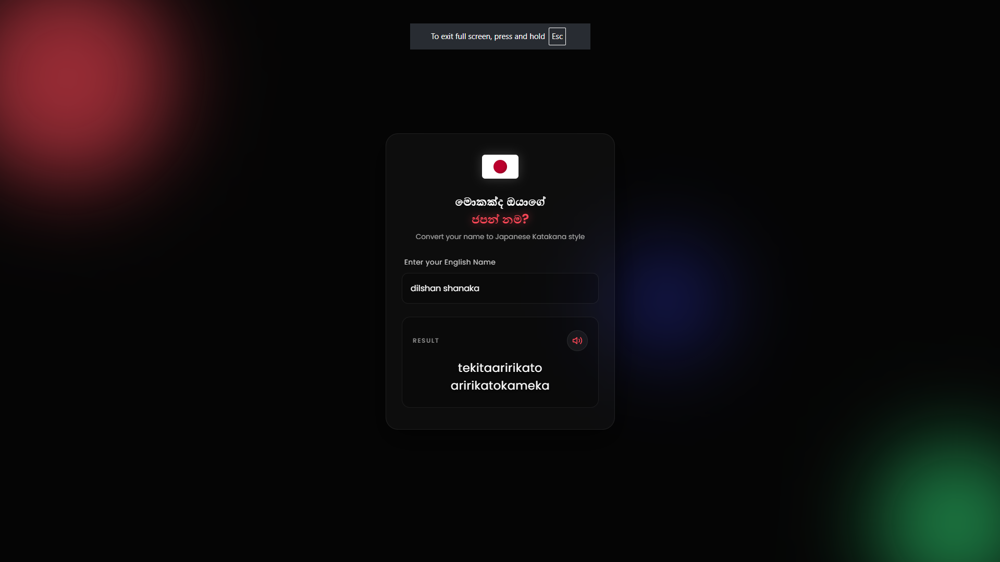
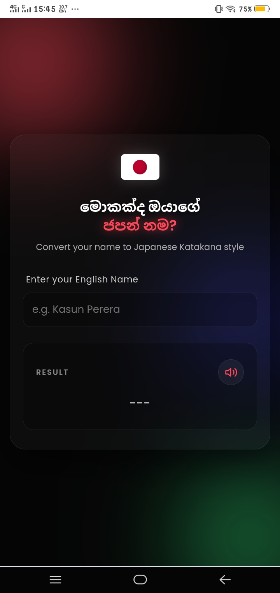

# 🇯🇵 Japanese Name Converter

A modern, responsive web application that converts your English name into Japanese Katakana-style syllables. Built with a beautiful Glassmorphism design and includes Text-to-Speech functionality.


---

## 🌟 Features

- ✨ **Modern Glassmorphism Design** - Beautiful frosted glass effect with animated backgrounds
- 📱 **Fully Responsive** - Works perfectly on mobile, tablet, and desktop
- 🔊 **Text-to-Speech** - Listen to your Japanese name pronunciation
- ⚡ **Real-time Conversion** - Instant results as you type
- 🎨 **Smooth Animations** - Engaging entrance and hover effects
- 🌙 **Dark Theme** - Easy on the eyes with a modern dark color scheme

---

## 🚀 Live Demo

Check out the live version here: **[https://shanaka2003.github.io/JapaneseNameConverter/](https://shanaka2003.github.io/JapaneseNameConverter/)**

---

## 📸 Screenshots

### Desktop View


### Mobile View


> 💡 *Tip: Replace the placeholder images above with actual screenshots of your project!*

---

## 🛠️ Technologies Used

| Technology | Purpose |
|------------|---------|
| HTML5 | Structure & Semantics |
| CSS3 | Styling & Animations |
| JavaScript (ES6) | Logic & Interactivity |
| Web Speech API | Text-to-Speech Functionality |
| Google Fonts | Typography (Poppins) |

---

## 📦 How to Run Locally

1. **Clone the repository**
   ```bash
   git clone https://github.com/shanaka2003/JapaneseNameConverter.git